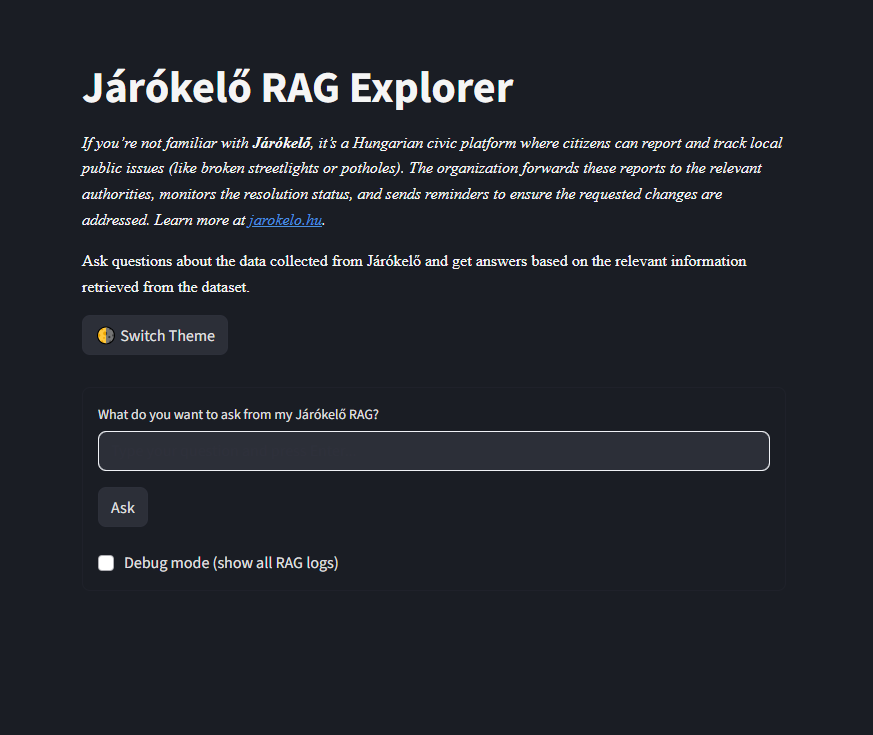

     

---

# Járókelő.hu RAG Pipeline

**Using RAG to evaluate the state of civic issues across Budapest**  

---

## Overview

This project builds a full **Retrieval-Augmented Generation (RAG)** pipeline for the data of [Járókelő.hu](https://jarokelo.hu), a Hungarian civic platform for reporting and tracking public issues across Budapest and other Hungarian cities.

It automates data scraping, preprocessing, chunking, embedding, vector store creation, and provides a Streamlit UI for interactive querying and debugging. I am currently working on exploratory data analysis and building an informative PowerBI dashboard for further insights on the type of civic insights and their state of resolution — by district, issue type, and many more.

> _This project came as a personal hobby. I regularly ride a bike around Budapest, and have been noticing disrepair, vandalism, and lack of care of our public spaces. Instead of just complaining or falling into apathy, I began using the Járókelő platform and found a new hope that even in a hostile political climate and a financially suffocated Budapest, issues can and will be resolved -- at least most of them, if reported to and tracked at the authorities._

## Features

- **Data scraping**: Automated collection of public reports from Járókelő.hu using Selenium, triggered on a daily basis. 
- **Preprocessing**: Cleans, normalizes, and chunks text for efficient retrieval, as well as for exploratory data analysis and Power BI reporting. Automated to run daily and on the arrival of any new scraped data.
- **Vector store**: Embeds and indexes the corpus using either FAISS or Chroma for fast semantic search.
- **RAG pipeline**: The core of the system, responsible for answering user queries by retrieving relevant issues and generating responses via LLM (currently OpenAI's ChatGPT).
- **Streamlit app**: User-friendly interface for interacting with the RAG pipeline.
- **Experiments**: More applied research focused section for comparing embedding models, vector stores, using state-of-the-art RAG evaluation techniques.
- **PowerBI dashboard**: A comprehensive interactive dashboard to understand the state of civic issues in a visual manner.

---

### Quickstart

1. Install dependencies

    poetry install

2. Scrape data

_From scratch_:

    poetry run python ./scripts/scrape_data.py --headless true --start-page 1 --until-date 2025-08-01

_Or if there is already an amount of scraped data under `data/raw`, the scraper can continue from the last-scraped entry:_

    poetry run python ./scraper/scrape_data.py --headless true --continue-scraping

3. Preprocess data

I implemented two types of preprocessing. One is specifically for the vector store and RAG functionality (`preprocess_rag.py`) while the other is for exploratory data analysis and extracting insights from data via Power BI dashboarding (`preprocess_eda.py`).

    poetry run python ./src/jarokelo_tracker/preprocess/preprocess_rag.py 

This loads raw jsonl files, cleans and normalizes their content, splits issue descriptions that are longer than 400 tokens to chunks, and saves the output to `data/processed/rag`.

    poetry run python ./src/jarokelo_tracker/preprocess/preprocess_eda.py 

This loads raw jsonl files, cleans and normalizes their content, and prepares a set of csv files for the Power BI dashboarding at `data/processed/powerbi`.

4.  Build vector store

    poetry run python ./scripts/build_vector_store.py --backend faiss --embedding sentence-transformers/distiluse-base-multilingual-cased-v2

This saves the vector store to `data/vector_store/<backend>_YYYYMMDDTHHMMSSZ`.

5. Run the RAG pipeline

    poetry run python ./src/jarokelo_tracker/rag/pipeline.py --query "What issues are not yet resolved in district 8 in Budapest?" --vector-backend "faiss" --headless true --top_k 5

Encodes the input query, fetches the top 5 closest matches from the vector store and feeds it to an LLM for answer generation.

6. Launch the streamlit app

    poetry run streamlit run streamlit_app/app.py

---

## Streamlit UI

The streamlit UI allows users to interact with my RAG service. For convenience, I added an optional debug checkbox which prints out the entire debug trace from the RAG pipeline. In case the RAG pipeline crashes, this comes very handy to pinpoint where the problem lies.

Main components and functionalities:

- **Query input**: Ask questions about civic issues.
- **Debug checkbox** and **debug logs**: If the checkbox is checked, detailed logs will be shown from the RAG pipeline. I added this for my convenience to pinpoint potential issues easier.
- **Result box**: Displays the final answer with completion time.

*The streamlit UI in dark mode*

## Automated workflows and MLOps

The repository leverages GitHub Actions for a robust, fully automated data and ML pipeline, incorporating MLOps best practices to this personal project.

- **Automated scraper**:
    - Runs nightly or on-demand via the [scraper.yml](./.github/workflows/scraper.yml) workflow
    - Scrapes new civic issue data from Járókelő.hu using Selenium.
    - Commits and pushes new raw data files to the repository automatically.

- **Automated data pipeline**:
    - Triggered by new data arrival (commit and push) or on-demand via [data_pipeline.yml](./.github/workflows/data_pipeline.yml).
    - Handles preprocessing (cleaning, normalization, chunking), vector store building, EDA report generation, and CSV file export for Power BI dashboarding.
    - Includes automated cleanup of old vector stores and cache management to stay within GitHub’s 10 GB cache limit (now only caching Poetry folders: ~/.cache/pypoetry/cache and ~/.cache/pypoetry/artifacts, ensuring we are around ~8 GB total cache).

- **Experiment results aggregation**:
    - Triggered automatically by new reports arrival (commit and push) or on-demand via [aggregate_embedding_results.yml](.github/workflows/aggregate_embedding_results.yml) to collect and aggregate experiment results from [embedding comparison](./experiments/embeddings_comparison.py)
    - **Todo**: This still has to be combined with an automated build and deploy step to immediately reflect on our Github page. 

## Experiments

This is a continuously evolving, applied research focused section aiming at presenting a state-of-the-art RAG system evaluation. 

1. **Embedding model comparison**:

The current [embeddings_comparison.py](./experiments/embeddings_comparison.py) script benchmarks multiple Hungarian, English, and multilingual sentence embedding models on real civic data.

2. **RAG evaluation**: (_todo, planned_)

Plan is to have a fully automated RAG evaluation pipeline which is continuously evolving as new methodologies arise. In progress...

---

## Github Pages

The project's [Github Pages site](https://leweex95.github.io/jarokelo_tracker/) is automatically updated with experiment results and (future) evaluation reports.
